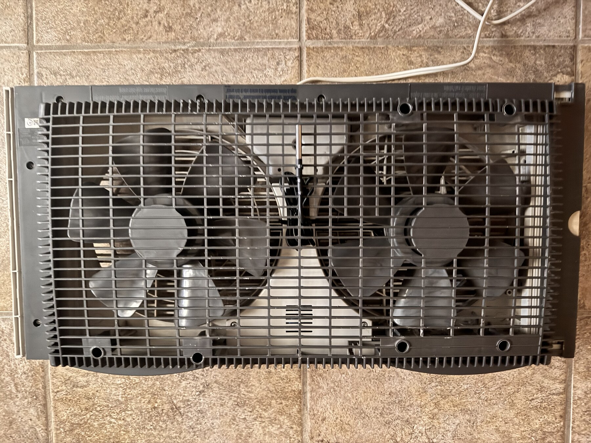

# Holmes HWF0910AT Window Fan Smart Mod

An independent retrofit of a working Holmes HWF0910AT twin window fan. The
project replaces the original non-isolated control electronics with an
ESP32-S3 controller, preserves the original physical-button sequence, and adds
an installable local PWA for fan, thermostat, schedule, lighting, diagnostics,
Wi-Fi provisioning, and OTA updates.

This repository is both a technical record and an engineering portfolio. It
documents the uncertain starting condition, reverse engineering, mistakes,
corrections, safety decisions, hardware integration, firmware, and validation.

> **Safety:** This prototype switches 120 VAC. It is not a certified appliance
> design. Do not reproduce, energize, or service it without the qualifications,
> isolation practices, enclosure, fusing, clearances, and test equipment
> appropriate for mains-voltage work. See [Safety](docs/safety.md).

## Result

- Original 13-step short-press loop and volatile long-press memory behavior.
- Safe OFF state whenever mains is newly detected.
- HIGH, LOW, thermostat modes, and 85-100% phase-angle speed control.
- Two-second full-power startup boost before a lower requested speed.
- Seven addressable indicators that mirror the active fan function.
- DS18B20 temperature, seven-day hourly history, timer, and weekly/daily schedule.
- Local AP setup, 2.4 GHz Wi-Fi provisioning, configurable static host address,
  authenticated app session, and separate firmware/LittleFS OTA uploads.
- Responsive bilingual PWA with mobile and desktop layouts.

## Repository Map

| Path | Purpose |
| --- | --- |
| [`firmware/`](firmware/) | Compilable ESP32-S3 sketch and LittleFS/PWA data |
| [`docs/`](docs/) | Architecture, hardware, pinout, firmware, tests, and decisions |
| [`assets/photos/`](assets/photos/) | Curated, resized, metadata-stripped project photos |
| [`assets/screenshots/`](assets/screenshots/) | Captures from the installed `0.3.10` PWA |
| [`assets/diagrams/`](assets/diagrams/) | Diagram source and exported reference material |

Start with [Architecture](docs/architecture.md), [Hardware](docs/hardware.md),
and [Firmware](docs/firmware.md). The complete photographic narrative is in
[Gallery](docs/gallery.md). The role and limits of the AI-assisted workflow are
recorded in [AI-Assisted Development](docs/ai-assisted-development.md). Spanish documentation starts at
[`README.es.md`](README.es.md).

## Current Reference Build

- Firmware: `0.3.10-led-state`
- Target: ESP32-S3, 4 MB flash, no PSRAM assumption
- Filesystem: LittleFS
- Web client: framework-free HTML/CSS/JavaScript PWA
- Control: zero-cross synchronized TRIAC firing through a MOC3023

Network names, household credentials, MAC addresses, local paths, and photo GPS
metadata are intentionally excluded. The source contains documented generic
first-run credentials; change them before deploying outside a trusted LAN.

## Project Status

The retrofit is operational and remotely serviceable. Remaining portfolio work
includes final calibrated LED color mapping, long-duration thermal logging,
formal electrical measurements, and a future demonstration video.

## AI-Assisted Development

ChatGPT and Codex were used in separate sessions from early research through
firmware, LittleFS/PWA development, debugging, documentation, and maintenance.
Their output was treated as a proposal to inspect, not as physical evidence.
Ivves selected each next step and validated the work against original module
diagrams, datasheets, continuity/voltage measurements, physical inspection, and
observed fan behavior.

AI did not solder, route or replace wiring, choose component placement, measure
physical distances, inspect mains clearances, operate instruments, or certify the
assembly. Those tasks and the final engineering judgment were human. Several AI
hypotheses and code errors were challenged and corrected during the project;
they remain in the engineering record rather than being hidden. See the
[full disclosure](docs/ai-assisted-development.md).

## License And Attribution

Source code and original documentation are released under the [MIT License](LICENSE).
Project photographs and screenshots remain copyright Ivves; see
[`assets/photos/LICENSE.md`](assets/photos/LICENSE.md). Holmes is a trademark of
its respective owner. This is an independent modification and is not affiliated
with, sponsored by, or endorsed by Holmes or its manufacturer.
