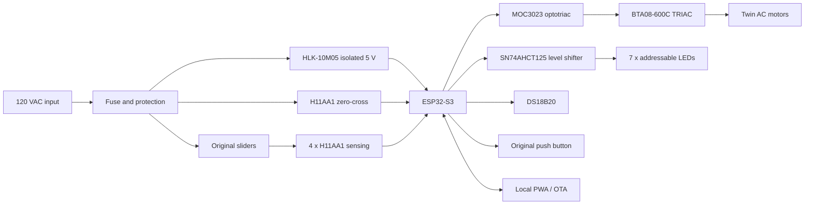

# Architecture

The design separates low-voltage control from the fan's mains power path. An
isolated HLK-10M05 supplies the ESP32-S3 domain. H11AA1 optocouplers report the
AC zero crossing and four original slider contacts. A MOC3023 transfers the
controller's firing command back across the isolation boundary to a BTA08 TRIAC.

## Control Layers

1. Interrupt handlers timestamp zero-cross and H11 edges.
2. The main loop derives mains presence, slider position, temperature, and time.
3. A state machine resolves button, web, thermostat, timer, and schedule requests.
4. The phase controller fires a short MOC pulse after a calibrated delay.
5. LED rendering derives its normal state from the resolved fan mode.
6. HTTP APIs expose state and accept explicit commands; page load is read-only.

The MOC pulse counter is command telemetry. It proves that firmware requested a
gate pulse while the safety conditions were satisfied; it cannot prove current
through the TRIAC or motor. That distinction is important in diagnostics.
