# Project Gallery

Only representative images are included. The source set remains private because
raw phone images contained location metadata and Live Photo companions. Public
derivatives were auto-oriented, resized, and stripped of metadata.

## Condition And Investigation

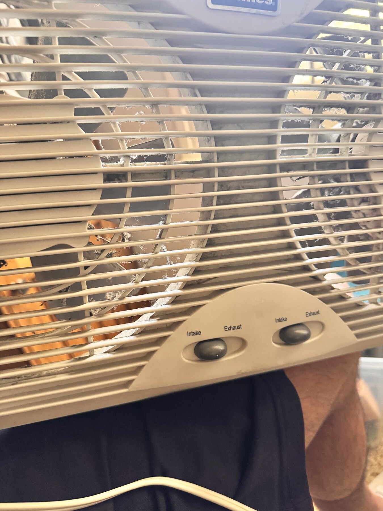

**Condition as received, before service.** The fan was operational but had
accumulated dust and lint during extended airflow duty, as window fans normally
do. The condition was documented before disassembly rather than concealed.

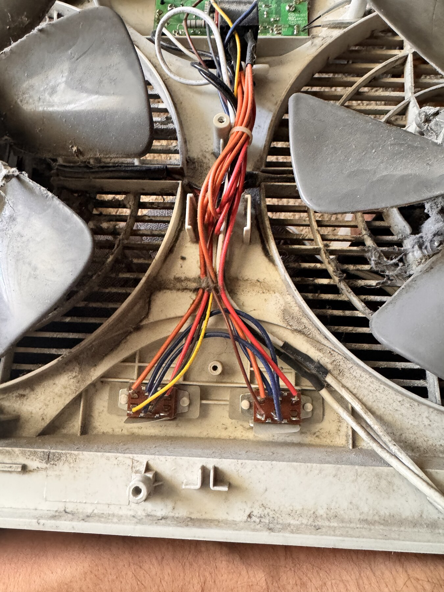

Original internal layout before replacement of the non-isolated controller.

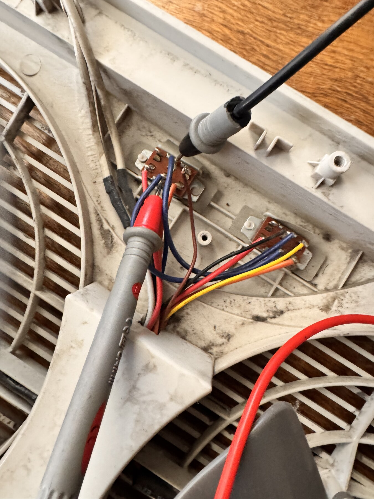

Tracing and measuring the existing control paths before assigning GPIO roles.

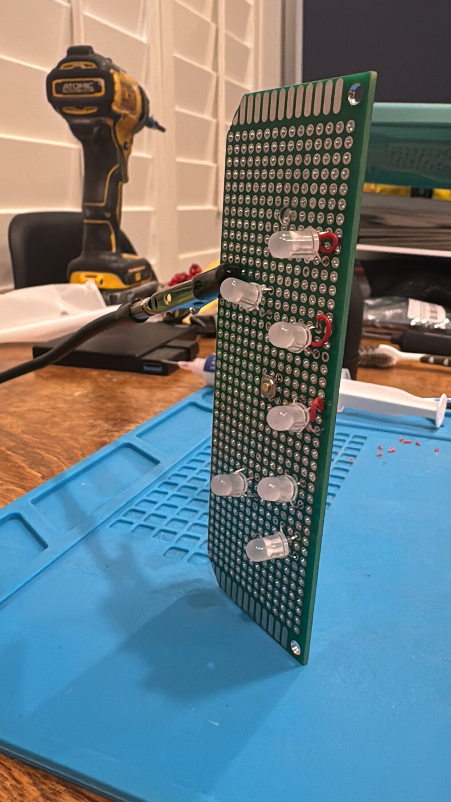

The original seven-position indicator layout informed the final LOW/temperature/
HIGH order and the digital representation in the PWA.

## Smart Mod Integration

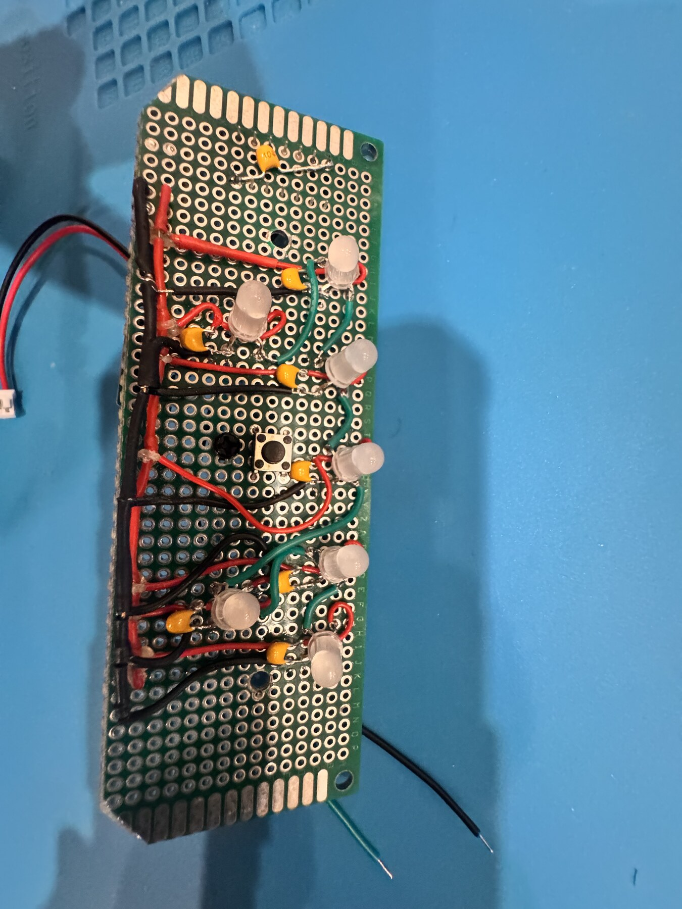

Low-voltage controller assembly during integration.

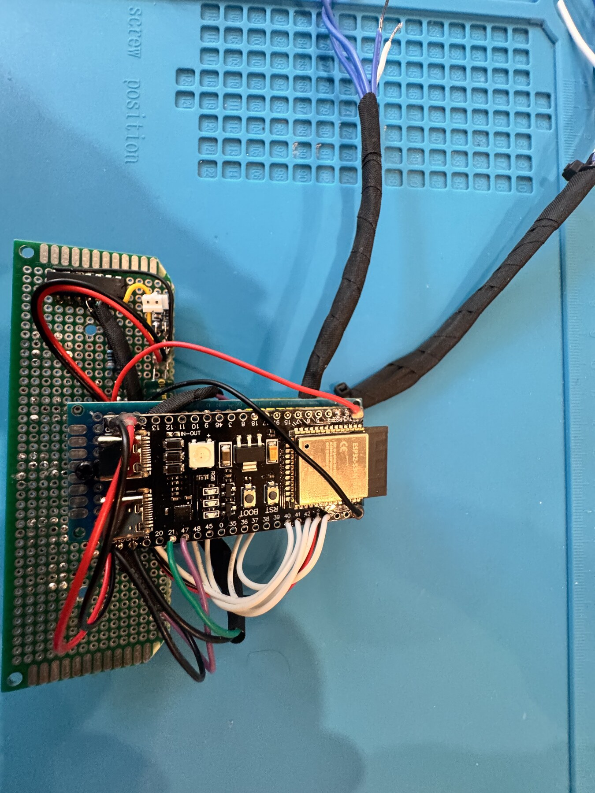

Completed ESP32-S3 controller before final installation.

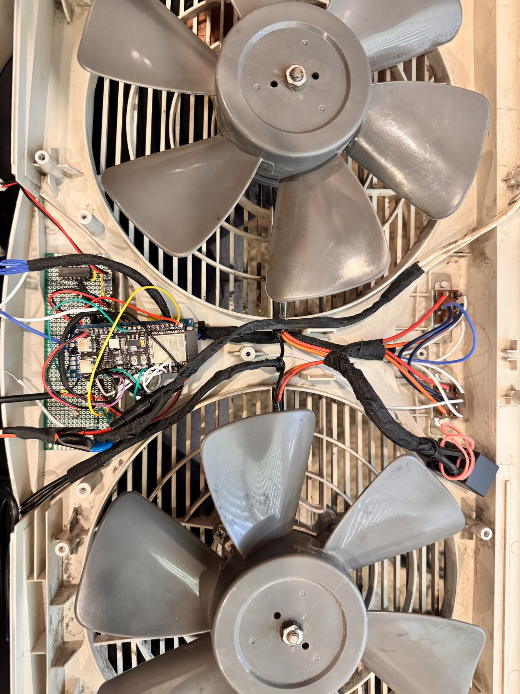

Controller installed in the fan enclosure.

## Final Condition After Service

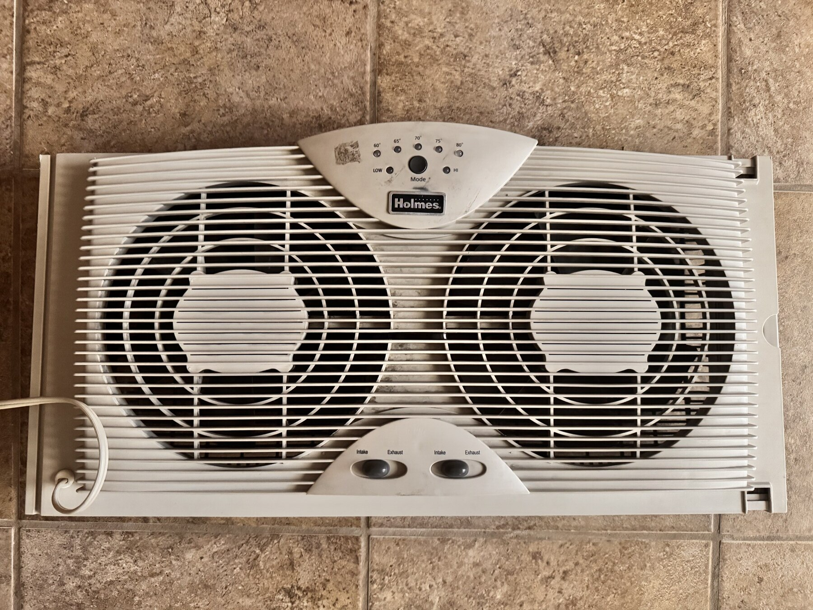

Front view after service and integration.

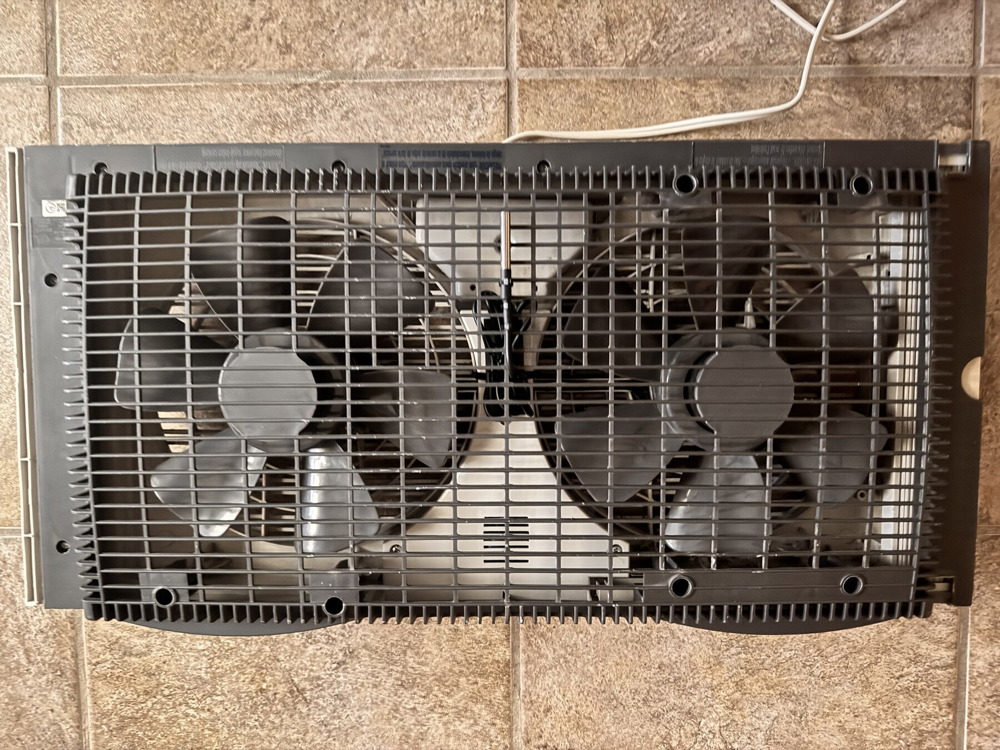

Rear view after service. The before/after comparison records the improvement
without presenting normal accumulated dust as the owner's living conditions.

## Application

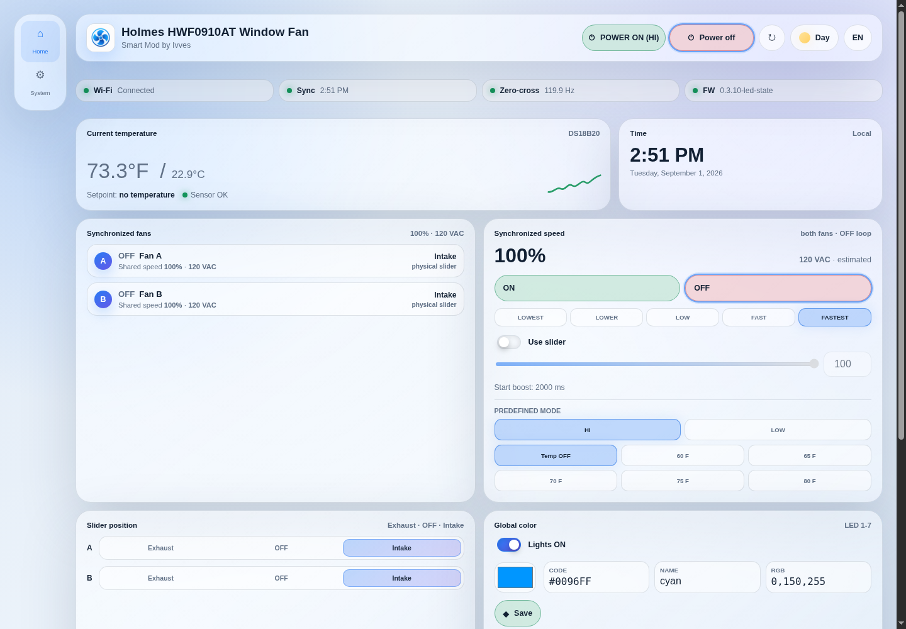

Desktop Home view served by the installed firmware.

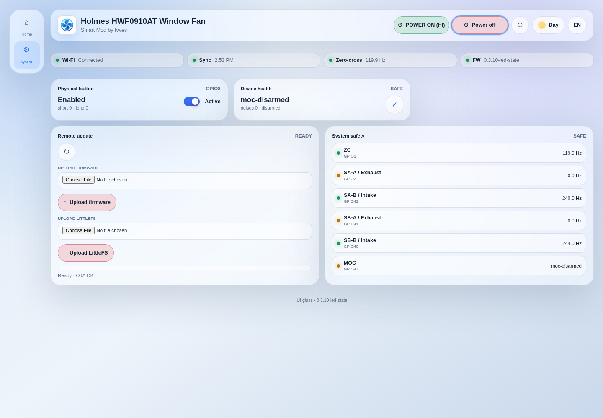

System diagnostics and separate firmware/LittleFS OTA controls. Household Wi-Fi
and activity details were intentionally excluded from the portfolio capture.

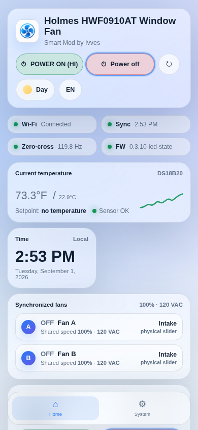

Installable mobile PWA layout.

Daily schedule and native-style 12-hour time wheels.
