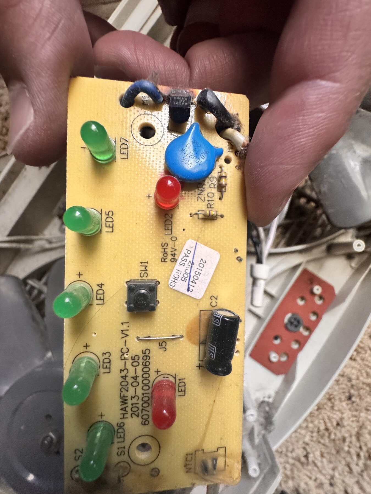

# Reverse Engineering

## Starting Point

The fan operated, but its internal electrical state and long-term reliability
were unknown. The first stage documented connectors, slider contacts, button
behavior, indicator order, motor wiring, and the existing control board before
replacement.

The original user sequence was measured as OFF, HIGH, LOW, five HIGH thermostat
targets, five LOW thermostat targets, then OFF. A 2.5-second press stored the
active mode only until mains power was removed.

## Findings

- The original low-voltage rail was not isolated as initially expected.
- Five H11AA1 channels were required: one zero-cross and four slider contacts.
- The TRIAC is not directly readable by the ESP32; the MOC drive is the observable
  command point and motor operation still requires physical verification.
- The indicator board order is LOW, 60, 65, 70, HIGH, 75, 80.
- ESP32-S3 GPIO21 is the LED data path and GPIO47 is the MOC trigger.

## Method

Measurements were taken with power removed whenever continuity was sufficient.
Energized observations were introduced only after isolation, pin mapping, and
safe-state firmware were in place. Each discovery was reflected in the pin map,
firmware constants, and subsequent tests instead of being left as an assumption.

ChatGPT and Codex helped organize hypotheses, compare module documentation, and
develop test/code iterations. Ivves performed the continuity tracing, physical
measurements, component placement, soldering, wiring, energized observations,
and final decisions. AI suggestions were explicitly rejected or corrected when
they conflicted with the physical fan or original component documentation.
