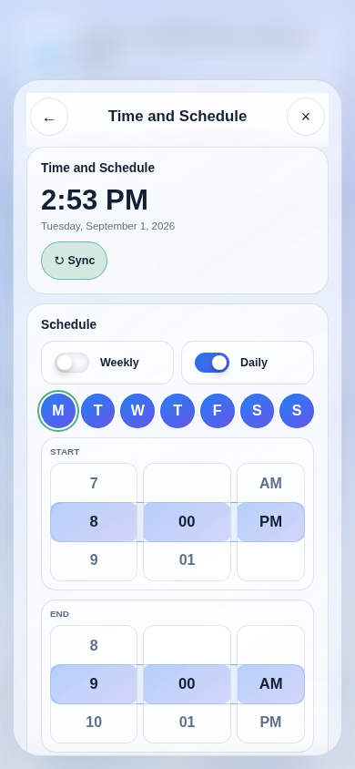

# Web Application

The ESP32-S3 serves a framework-free, bilingual PWA from LittleFS. It works as a
single-page application with Home/System views and glass-styled detail overlays.

## Home

- Live Wi-Fi, clock sync, zero-cross, and firmware indicators.
- Temperature summary and seven-day hourly detail history.
- Explicit POWER ON (HI) and Power off commands.
- Fan state, shared 85-100% control, HIGH/LOW/temperature presets, and sliders.
- Global LED color/dimmer plus seven physical-function indicators.
- Timer and mutually exclusive Weekly/Daily scheduling with 12-hour time wheels.

## System

- Physical-button enable switch.
- Device-health command telemetry and zero-cross/H11 module activity.
- Wi-Fi scanning, password entry, DHCP connection, and last-octet static-IP setup.
- Separate OTA upload controls for firmware and LittleFS with progress/reboot.

## Session Behavior

Unknown devices see an empty login form. A successful login can be remembered in
that browser. Initial page synchronization performs only GET requests; opening a
second phone must not replay stale controls or interrupt an active schedule.

The default generic app login is `thankyou` / `youarewelcome`. It is not a cloud
identity system and should be changed during commissioning.

The detail presentation is technically a **modal overlay** (also called a modal
dialog). Cards kept on Home do not open one unless additional detail is useful.
